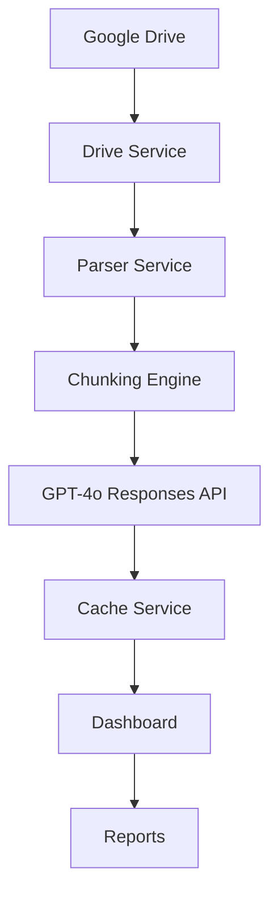
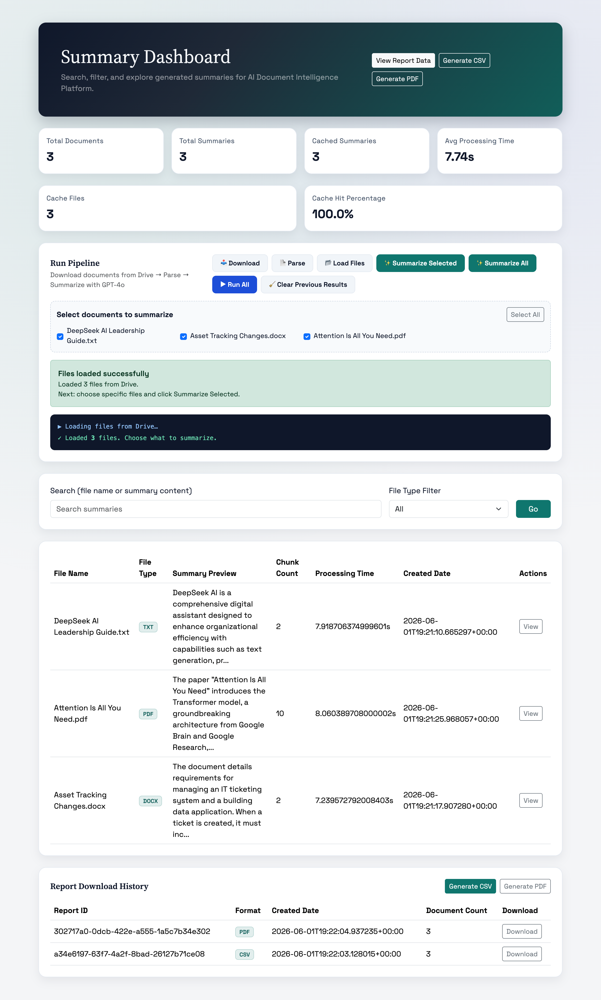
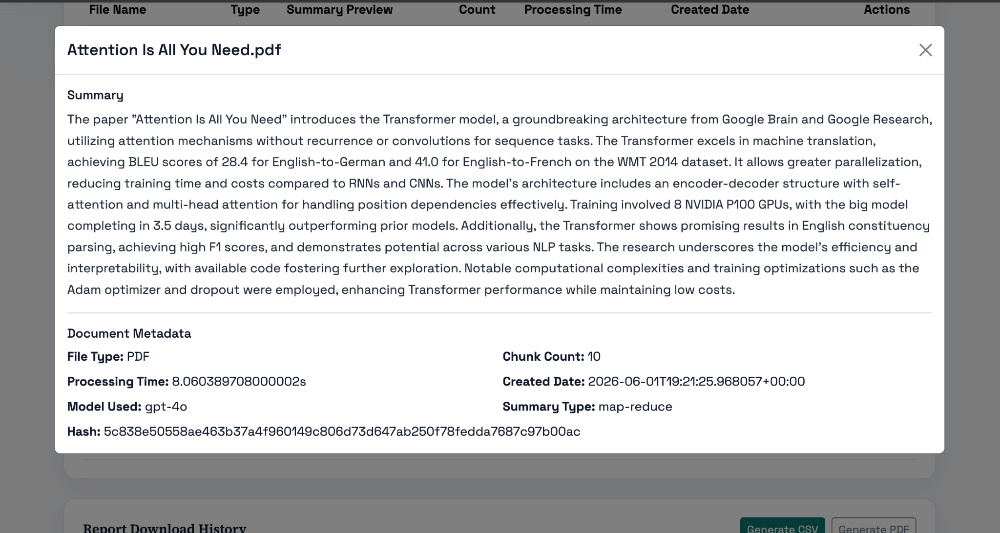
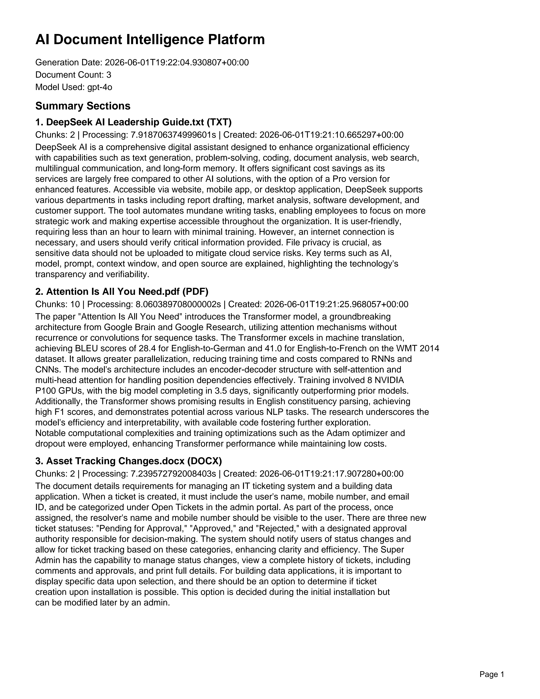

# AI Document Intelligence Platform


AI Document Intelligence Platform is a production-ready FastAPI application that turns Google Drive documents into searchable, summarized intelligence. It ingests files from Drive, parses PDF/DOC/DOCX/TXT content, and generates GPT-4o-powered summaries with token-aware chunking and map-reduce processing for longer documents.

The product is built around a dashboard-first workflow. Users can trigger ingestion, parsing, selective summarization, full summarization, and report generation from one place, then inspect results in a modal-based detail view. The same dashboard also exposes CSV/PDF exports and report history, creating a single operational workspace rather than a set of disconnected tools.

## Why This Project Matters

This project shows more than API wiring: it demonstrates how to design a complete AI document workflow end to end. It combines external integrations, async AI calls, file processing, caching, reporting, and UI polish in a way that mirrors real business automation problems.

For recruiters and hiring managers, it highlights a few useful signals:
- Full-stack product thinking, not just backend endpoints
- Practical LLM integration with cost-aware caching and chunking
- Clean service boundaries and maintainable architecture
- Production readiness through testing, linting, typing, security scanning, Docker, and CI/CD
- A user-centered dashboard experience that makes the workflow easy to use and easy to understand

## Features

- ✅ Google Drive Integration
- ✅ PDF / DOCX / TXT Processing
- ✅ GPT-4o Responses API
- ✅ Token-Aware Chunking
- ✅ Map-Reduce Summarization
- ✅ SHA256 Cache Layer
- ✅ Dashboard UI
- ✅ Search & Filtering
- ✅ CSV Export
- ✅ PDF Export
- ✅ Docker Support
- ✅ CI/CD Pipeline

## Architecture



For a deeper architecture breakdown, see [docs/architecture.md](docs/architecture.md).

## Screenshots

### Dashboard


### Summary Detail


### Report Center


## Quick Start

### Environment Setup

```bash
python -m venv .venv
source .venv/bin/activate
```

### Installation

```bash
pip install -r requirements.txt
cp .env.example .env
```

Set the required values in `.env`:
- `OPENAI_API_KEY`
- `GOOGLE_DRIVE_FOLDER_ID`
- `GOOGLE_SERVICE_ACCOUNT_FILE`

For Google Drive authentication, copy [service-account.example.json](service-account.example.json) to `service-account.json` and fill in your real credentials locally. The real file is ignored by git.

### Running Locally

```bash
uvicorn app.main:app --host 0.0.0.0 --port 8000 --reload
```

Open:
- Dashboard: `http://127.0.0.1:8000/dashboard`
- API Docs: `http://127.0.0.1:8000/docs`

### Docker Usage

```bash
docker-compose up --build
```

## Technology Stack

### Backend
- FastAPI
- Python 3.12

### AI
- OpenAI GPT-4o
- tiktoken

### Document Processing
- PyMuPDF
- python-docx

### Testing
- Pytest
- Coverage

### DevOps
- Docker
- GitHub Actions

## Testing & Quality

- 33+ tests passing
- 80%+ coverage target on core maintainability layers
- Ruff
- Black
- MyPy
- Bandit
- pip-audit

Common commands:

```bash
make test
make coverage
make lint
make typecheck
make security
```

## Documentation

- [Architecture](docs/architecture.md)
- [API Reference](docs/api-reference.md)
- [Developer Guide](docs/developer-guide.md)

## Future Improvements

- Advanced reporting extensions and richer analytics visualizations
- Multi-user auth and tenant isolation
- Persistent analytics warehouse for trend intelligence

## License

MIT
