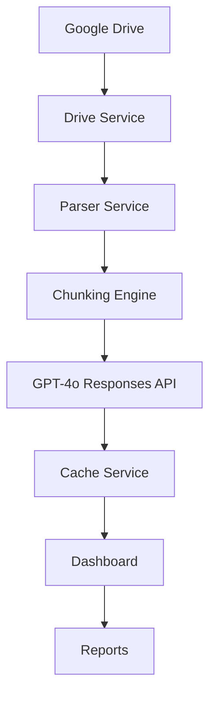
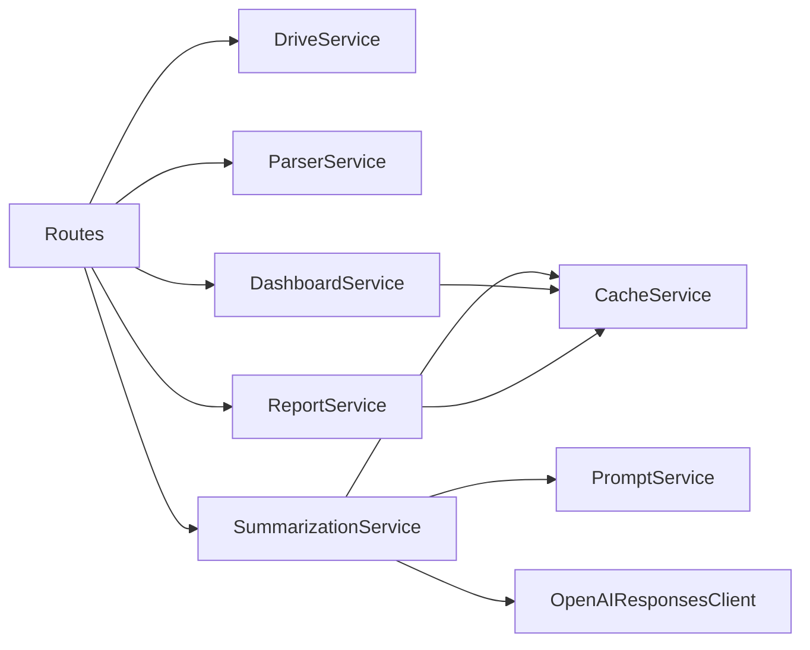
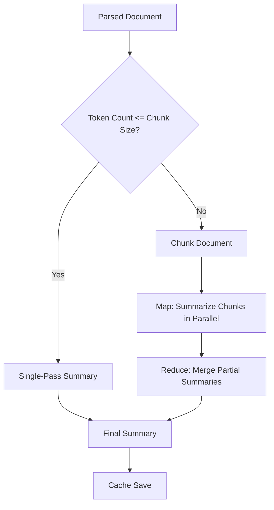

# Architecture

## System Overview
AI Document Intelligence Platform is a service-oriented FastAPI application that ingests documents from Google Drive, parses and summarizes them with GPT-4o, and exposes results through a dashboard and export workflows.

The routing layer remains intentionally thin. Core business logic lives in services to keep API handlers small, testable, and maintainable.

## High-Level Flow


## Service Architecture


### Layering Rule
- Routes -> Services -> Models/Utilities
- Routes should not implement heavy business logic.
- OpenAI interaction is encapsulated in `SummarizationService` and `OpenAIResponsesClient`.

## Codebase Structure
```text
AI-Document-Intelligence-Platform/
├── app/
│   ├── main.py
│   ├── config.py
│   ├── api/
│   │   ├── dependencies.py
│   │   └── routes.py
│   ├── services/
│   │   ├── drive_service.py
│   │   ├── parser_service.py
│   │   ├── summarization_service.py
│   │   ├── cache_service.py
│   │   ├── dashboard_service.py
│   │   ├── report_service.py
│   │   ├── prompt_service.py
│   │   └── storage_service.py
│   ├── models/
│   │   ├── document.py
│   │   ├── parsed_document.py
│   │   ├── summary.py
│   │   └── report.py
│   ├── templates/
│   │   ├── index.html
│   │   └── dashboard.html
│   ├── static/css/
│   │   └── dashboard.css
│   └── utils/
│       ├── logger.py
│       ├── chunking.py
│       ├── hashing.py
│       └── exceptions.py
├── prompts/
│   ├── map_summary.txt
│   └── reduce_summary.txt
├── reports/
│   ├── exports/
│   └── metadata/
├── cache/
├── downloads/
├── tests/
├── .github/workflows/ci.yml
├── Dockerfile
├── docker-compose.yml
└── README.md
```

## Ingestion and Parsing Architecture

### Drive Ingestion
- Auth via Google Service Account credentials.
- Source scanning by folder ID.
- Supported ingestion types include:
  - PDF
  - DOC
  - DOCX
  - TXT
  - Google Docs (exported to DOCX for processing)
- Download storage is abstracted through `StorageService`.

### Parsing Pipeline
- Factory-based parser resolution by extension.
- Parsers:
  - `PDFParser` (PyMuPDF)
  - `DOCParser` (legacy DOC via `textutil` when available)
  - `DOCXParser` (python-docx)
  - `TXTParser` (UTF-8 with fallback)
- Content validation checks:
  - Non-empty extraction
  - Minimum character length
  - Minimum word count

Legacy `.doc` support is capability-based. If `textutil` is unavailable on the host system, `.doc` files are omitted from supported Drive listings and the app continues to function for PDF/DOCX/TXT inputs.

## AI Summarization Architecture

### GPT-4o Integration
- Uses OpenAI Responses API through `AsyncOpenAI`.
- Model configured via settings (`OPENAI_MODEL`).
- Prompt templates loaded from filesystem via `PromptService`.

### Map-Reduce Workflow


### Chunking Strategy
- Token-aware chunking via `tiktoken`.
- Configurable size and overlap:
  - `SUMMARY_CHUNK_SIZE`
  - `SUMMARY_CHUNK_OVERLAP`
- Maintains contextual continuity while staying within model limits.

## Cache Architecture

### Strategy
- Document fingerprinting uses SHA256 hash of document content.
- Cache records stored as JSON in `cache/<hash>.json`.
- Cache hit skips OpenAI call and returns stored `SummaryResult`.
- `force_refresh=true` can bypass cache to regenerate improved summaries.

### Cache Metrics
Dashboard computes:
- Total cache files
- Cached summaries
- Cache hit percentage

## Dashboard Architecture

### UX Model
The primary UX is dashboard-first and single-page oriented.

Dashboard includes:
- Pipeline action center:
  - Download
  - Parse
  - Load Files
  - Summarize Selected
  - Summarize All
  - Run All
  - Clear Previous Results
- Operation status panel with explicit next-step guidance.
- Search/filter table for summaries.
- Modal-based summary detail view.
- Integrated report generation and report history table.

### Dashboard Rule
- Routes -> DashboardService -> Cache data

## Report Generation Architecture

### Report Outputs
- CSV and PDF generated from cached summary records.
- Exports stored in `reports/exports`.
- Metadata history stored in `reports/metadata` as JSON.

### ReportService Responsibilities
- Build structured rows from summary records.
- Generate CSV with stable column ordering.
- Generate paginated PDF with headers, sections, metadata, and footers.
- Persist report metadata (`report_id`, format, file path, document count, created time).
- List and retrieve report history.
- Clear report artifacts during full dashboard cleanup flow.

### Report Rule
- Routes -> ReportService -> Exports + Metadata

## Reliability and Maintainability Choices
- Retry behavior for external I/O (Drive/OpenAI failure scenarios).
- Service isolation for easier unit testing.
- Typed models for every service boundary.
- Dependency injection via route dependencies.
- Centralized config validation with pydantic-settings.

## Performance Decisions
- Concurrent map phase (`asyncio.gather`) for large documents.
- Hash-based cache to avoid repeated inference.
- Timing metadata persisted to monitor processing characteristics.

## Production Hardening and DX
- Formatting/lint: Black + Ruff
- Typing: MyPy
- Tests: Pytest (+ coverage target)
- Security scanning: Bandit + pip-audit
- Pre-commit hooks and GitHub Actions CI

## Current Scope and Extensions
Implemented:
- End-to-end ingestion, parsing, summarization, dashboard, report export, and hardening.

Not yet implemented:
- Advanced reporting extensions
- Multi-user authorization model
- Long-term analytics storage layer
